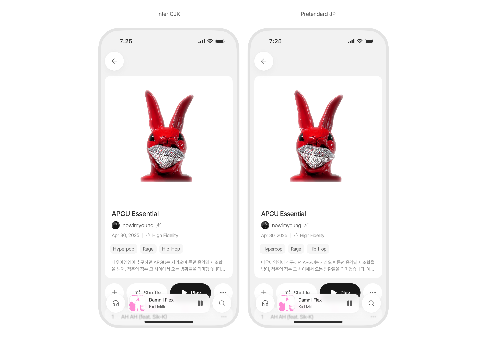

# Inter CJK

Inter CJK는 [Inter](https://rsms.me/inter)에 [Pretendard JP](https://github.com/orioncactus/pretendard)의 한국어, 일본어, 중국어 Glyph를 결합한 후, UI 등 주요 사용 용도에 맞게 보정한 폰트입니다.


## 도대체 왜



Pretendard JP는 다국어를 폭넓게 지원해 범용 서체로 쓰기 좋지만, 영미권 텍스트의 가독성이나 `@`, `[`, `(` 같은 기호 디테일까지 고려하면 Inter가 더 적합합니다.

다만 Inter는 CJK를 지원하지 않아 한국·일본·중국어가 포함된 환경에선 단독으로 쓰기 어렵습니다. Inter CJK는 Pretendard JP의 CJK 글리프를 Inter에 결합하고 calt 피처 보완과 Line Height 조정을 거쳐 Pretendard의 설계 원칙을 유지하면서도 Inter의 라틴 품질을 그대로 살린 서체입니다.

# Font Families

- **Inter CJK** — Text-optimized (optical size 14)
- **Inter CJK Display** — Display-optimized (optical size 32)

## Variable Axes

| Axis | Tag | Range | Default |
|------|-----|-------|---------|
| Optical Size | `opsz` | 14–32 | 14 |
| Weight | `wght` | 100–900 | 400 |

## Coverage

- Latin, Cyrillic, Greek (from Inter)
- Hangul Syllables: 11,172
- Hiragana + Katakana: 184
- CJK Unified Ideographs: 7,138
- CJK Symbols, Compatibility, Halfwidth/Fullwidth Forms

## Design Philosophy

Adjustments applied from [Pretendard](https://cactus.tistory.com/306) and [SUIT](https://sun.fo/suit/) design principles:

- **Vertical alignment**: CJK glyph center aligned to Latin cap height center
- **Gray-level matching**: CJK strokes 1% thinner for visual weight balance with Latin
- **Script transition spacing**: +100 units between Latin↔CJK characters
- **Vertical metrics**: Symmetric around cap height center (SUIT-matched ratio 1.248)
- **Tabular numbers**: Consistent width across all weights (tnum)

## OpenType Features

`calt` `ccmp` `case` `dlig` `frac` `sups` `subs` `sinf` `dnom` `numr` `tnum` `zero` `cpsp` `kern` `mark` `mkmk`

Stylistic Sets:
- `ss01` Straight-sided six and nine
- `ss02` Open four
- `ss03` Centered colon
- `ss05` Korean localization (contextual ellipsis)
- `ss06` Enhanced readability / Disambiguation
- `ss07` Single-storey a
- `ss08` Straight three

Character Variants: `cv01`–`cv14`

## Build

```bash
pip install -r requirements.txt
make variable    # builds InterCJK-Variable.ttf
make static      # builds static instances
```

## Source Structure

```
src/
  InterCJK.glyphspackage/   # Glyphs 3 source
    fontinfo.plist           # Font metadata, axes, instances
    order.plist              # Glyph order
    glyphs/                  # Individual glyph files
  features/                  # OpenType feature files (.fea)
fonts/
  variable/                  # Pre-built variable font
```

## Credits

- **Latin base**: [Inter](https://rsms.me/inter/) by Rasmus Andersson
- **CJK base**: [Pretendard JP](https://github.com/orioncactus/pretendard) by Kil Hyung-jin
- **CJK Hangul source**: [Noto Sans CJK KR](https://github.com/adobe-fonts/source-han-sans)
- **CJK Kana source**: [M PLUS 1p](https://github.com/coz-m/MPLUS_FONTS)

## License

[SIL Open Font License 1.1](LICENSE.txt)
